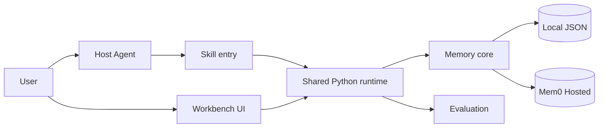
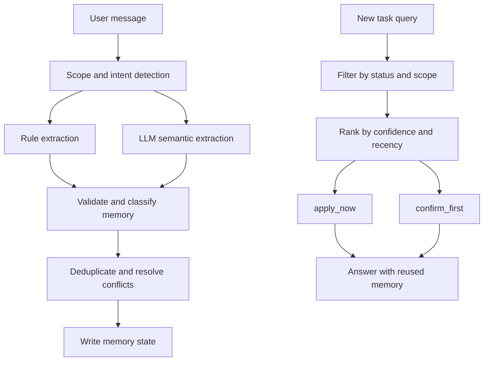
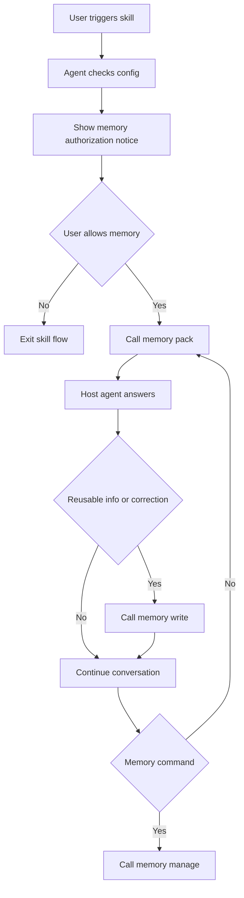

# Assist Everything BetterAndBetter Skill

Assist Everything BetterAndBetter is an authorized collaborative memory skill for agent workflows. It helps a host agent reuse user-approved preferences, constraints, history, decisions, and correction lessons across sessions, so users do not need to repeat the same context in every similar task.

The repository provides two complementary ways to use and evaluate the skill:

- **Direct Skill**: an installable skill entry for host agents such as Codex or Claude Code.
- **Workbench**: a browser-based testing and evaluation workspace that visualizes skill behavior, memory changes, cognitive load, and memory reuse across multiple rounds.

The system is organized around shared memory behavior. Direct Skill and Workbench use the same memory core and shared agent runtime so that behavior observed in Workbench matches behavior users get through the installed skill.

## Repository Map

```text
skill/
  SKILL.md                         # host-agent skill entry
  docs/                            # progressive docs for config, runtime, memory policy, eval

assist_everything_betterandbetter_skill/
  skill.py                         # memory extraction, update, recall, and management
  memory.py                        # Local JSON / Markdown memory store
  mem0_backend.py                  # Mem0 Hosted backend
  runtime_config.py                # shared runtime configuration
  cli.py                           # direct skill memory tools
  direct_agent.py                  # direct skill and standalone agent runtime

evalharness/
  server.py                        # Workbench API server
  agent.py                         # shared agent runtime
  llm.py                           # MiniMax / DeepSeek provider configuration
  evaluation.py / judge.py         # evaluation scoring
  static/                          # Workbench frontend
  persona/                         # soul.md / identity.md

scripts/
  verify_eval.py                   # auxiliary verification
  run_stability_eval.py            # auxiliary stability evaluation
  build_*.py                       # document and artifact builders
```

`scripts/` is not the main runtime path for either Workbench or Direct Skill. The primary entry points are Python module commands.

## Architecture



The diagram is intentionally simple:

- `skill/` provides instructions and the host-agent trigger.
- `assist_everything_betterandbetter_skill/` provides the memory runtime.
- `evalharness/` provides the Workbench server, evaluation layer, LLM provider adapters, message schemas, and shared agent turn orchestration.
- Workbench and Direct Skill share this runtime so the same memory behavior can be used interactively and evaluated visually.

## Why Workbench And Direct Skill Both Exist

Direct Skill is the natural usage path. A user invokes the skill inside a host agent and continues a normal multi-turn conversation.

Workbench exists because memory behavior is difficult to judge from a single chat transcript. It provides an intuitive testing and evaluation surface for:

- observing memory extraction, recall, updates, deletion, and backend state
- comparing multiple sessions of the same task
- visualizing changes in user cognitive load after the skill starts reusing memory
- checking whether memory reuse improves task quality without forcing the user to repeat information
- testing both Local JSON and Mem0 Hosted backends

This structure is based on a practical requirement: a memory skill needs both a real agent usage path and a transparent evaluation surface. Direct Skill proves the runtime can be used by host agents; Workbench makes the memory behavior inspectable and measurable.

## Shared Runtime Design

Direct Skill does not depend on the Workbench frontend. It currently reuses the shared agent runtime under `evalharness/` for provider adapters, turn orchestration, and message schemas.

This keeps the interactive Workbench path and the installed Direct Skill path aligned. The same memory extraction, recall, update, and management behavior is exercised in both places, which avoids divergent implementations.

The runtime can be further optimized and abstracted over time, but the current structure already separates the host-agent skill entry, memory core, Workbench interface, and auxiliary scripts clearly enough for use and evaluation.

## Setup

```bash
python3 -m venv .venv
. .venv/bin/activate
python3 -m pip install -r requirements.txt
```

Editable install:

```bash
python3 -m pip install -e ".[test]"
```

Prepare configuration:

```bash
cp .env.example .env
```

MiniMax is the default configured provider for Workbench Agent Chat and LLM evaluation:

```dotenv
ASSIST_AGENT_PROVIDER=minimax
MINIMAX_API_KEY=<fill-your-minimax-api-key>
MINIMAX_BASE_URL=https://api.minimax.io/v1
MINIMAX_MODEL=MiniMax-M2.7
MINIMAX_TIMEOUT=60
```

Optional DeepSeek configuration:

```dotenv
DEEPSEEK_API_KEY=<fill-your-deepseek-api-key>
DEEPSEEK_BASE_URL=https://api.deepseek.com/v1
DEEPSEEK_PRO_MODEL=deepseek-v4-pro
DEEPSEEK_FLASH_MODEL=deepseek-v4-flash
DEEPSEEK_TIMEOUT=60
```

## Memory Configuration

Default memory backend:

```dotenv
ASSIST_MEMORY_ENABLED=1
ASSIST_MEMORY_PERSIST=1
ASSIST_MEMORY_DIR=memories/default
ASSIST_MEMORY_BACKEND=local
ASSIST_RUNTIME_PROFILE=default
```

Optional Mem0 Hosted backend:

```dotenv
ASSIST_MEMORY_BACKEND=mem0_hosted
MEM0_PROJECT_NAME=test-self-improving-202606
MEM0_BASE_URL=https://mem0-cnlfjzigaku8gczkzo.mem0.volces.com:8000
MEM0_API_KEY=<fill-your-mem0-api-key>
MEM0_USER_ID=workbench-user
MEM0_APP_ID=assist-everything-betterandbetter-skill
MEM0_TIMEOUT=15
MEM0_PROJECT_ID=<fill-your-mem0-project-id>
```

`memories/`, `.env`, and `1.env` are git-ignored so local user memory and credentials do not leak into commits.

## Memory Authorization And Policy

On first Direct Skill activation, the agent must tell the user:

- memory is enabled or disabled
- active backend is `local` or `mem0_hosted`
- continuing means authorizing memory reads and writes for this conversation
- available memory commands include `展示当前记忆`, `删除...`, `降级...`, and `清空记忆`
- the user can say `退出 skill` or `不允许记忆` to leave the skill flow

Memory types:

- `preference`: soft preference used for ranking or style
- `constraint`: hard limit, taboo, exclusion, or budget
- `workflow`: reusable interaction rule learned from user correction
- `decision`: current-task choice that should be continued
- `history`: past action or event that affects continuity or avoidance
- `context_fact`: background fact useful for the task

Validity layers:

- `current_task`: applies by default only in the current task
- `scene_memory`: recalled in similar scenes, but should be confirmed
- `long_term`: stable preference or rule
- `past`: historical fact for continuity and avoiding repetition

## Memory Extraction And Recall



Write path:

1. Rule extraction catches high-confidence structured signals such as budget, taboo, previous gifts, explicit deletion, and obvious travel/study/work constraints.
2. LLM semantic extraction handles context-dependent intent such as "choose the Polaroid", "repeating a candidate name means selected", and "from now on...".
3. The skill validates candidates, assigns scope, confidence, and validity layer, then deduplicates before writing.

Recall path:

1. Filter by active status, task scope, recipient/target, privacy, and deletion state.
2. Rank by confidence, layer, keyword/entity hits, user approval, and recency.
3. Use `apply_now` memories directly.
4. Use `confirm_first` memories as cautious reminders while still providing a concrete answer.

## Run Workbench

```bash
python3 -m evalharness.cli --env-file .env serve --port 8787 --agent minimax
```

Open:

```text
http://127.0.0.1:8787
```

Workbench modules:

- `Agent Chat`: real LLM chat, current memory panel, and manual LLM evaluation.
- `History Evals`: grouped historical evaluations with multi-round comparison.
- `Settings`: Agent, Skill, Memory, and Eval rule settings.
- `Memory Scale Eval`: large-memory performance evaluation line.

Suggested Workbench check:

1. Open `Agent Chat`.
2. Run a multi-round task such as "choose a birthday gift for my girlfriend".
3. Run LLM Eval after each session.
4. Open `History Evals`.
5. Compare cognitive load, memory saving points, and quality dimensions across sessions.

For reproducible validation scripts and manual test conversations, use
[TEST_SAMPLES.md](TEST_SAMPLES.md). It contains the current Workbench preset
scenarios in UI order, plus additional gift-selection and workflow-learning
cases that can be replayed in both Workbench and Direct Skill.

## Use Direct Skill

The Direct Skill installation entry is:

```text
skill/
```

Installing only `skill/` installs the host-agent instructions, not a standalone runtime. Direct Skill also needs the repository runtime to be present, or the Python package installed in the host environment.

Smoke test:

```bash
python3 -m assist_everything_betterandbetter_skill.cli --env-file .env config
python3 -m assist_everything_betterandbetter_skill.cli --env-file .env memory-pack "帮我给女朋友选个礼物"
python3 -m assist_everything_betterandbetter_skill.cli --env-file .env memory-manage "展示当前记忆"
```

Trigger inside a host agent:

```text
$assist-everything-betterandbetter-skill 帮我给女朋友选个礼物
```

Continue naturally in the same conversation:

```text
预算 1000 元
选拍立得
展示当前记忆
删除 紫色
退出 skill
```

To start a new session while keeping long-term memory, use two user turns: first ask to reset the current session, wait for the agent to confirm, then send the next task.

The same validation conversations used in Workbench can also be replayed after
triggering the installed skill. See [TEST_SAMPLES.md](TEST_SAMPLES.md) for the
exact turns and expected memory behavior, including cross-session gift recall
and learned workflow handling for short follow-up queries such as "销售渠道".

### Direct Skill Step Flow



## Eval

Workbench evaluation is the primary way to inspect behavior over multiple sessions. CLI evaluation is available for reproducible runs:

```bash
python3 -m evalharness.cli --env-file .env run --agent minimax --judge minimax
```

Evaluation focuses on:

- six quality dimensions
- user cognitive load
- memory saving information points
- memory extraction, application, update, and deletion correctness
- task delivery
- semantic violations and repeated clarification

Auxiliary verification:

```bash
python3 scripts/run_stability_eval.py
python3 scripts/verify_eval.py
```

These scripts are helper tools, not the main Workbench or Direct Skill entry point.

## What To Verify

Start with [TEST_SAMPLES.md](TEST_SAMPLES.md) when validating a fresh clone.
It is the source-of-truth checklist for manual replay:

- the four Workbench preset scenarios, in the same order as the UI
- the three-round girlfriend gift scenario for add/update/delete memory behavior
- cross-session recall of selected gifts
- workflow self-learning after user correction
- equivalent Direct Skill runtime checks

Workbench path:

1. `evalharness.cli serve` starts successfully.
2. Agent Chat uses a real LLM provider.
3. Current Memory shows Local JSON or Mem0 Hosted state.
4. Run LLM Eval writes results into History Evals.
5. Multi-round tasks show changes in cognitive load and memory saving points.

Direct Skill path:

1. The host agent can load `skill/SKILL.md`.
2. First activation shows memory backend, authorization, memory commands, and exit instructions.
3. `memory-pack` recalls relevant constraints.
4. `memory-write` records budgets, preferences, choices, and user corrections.
5. `memory-manage` supports show, delete, downgrade, archive, reset, profile, snapshot, layers, and privacy reports.
