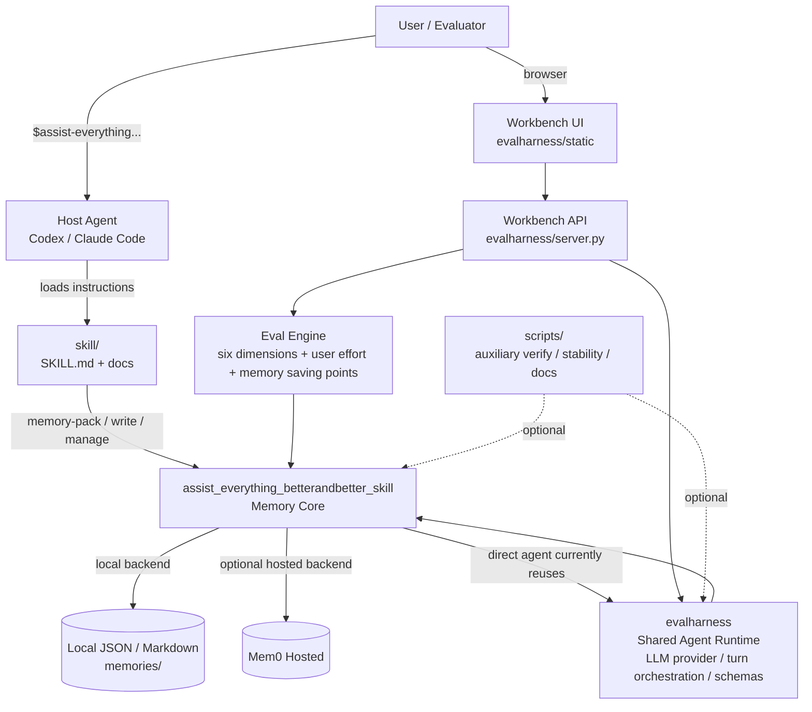

# Assist Everything BetterAndBetter Skill

这是一个面向比赛演示的“授权式协作记忆 Skill”。它同时提供两条使用路径：

- **Workbench**：浏览器里的真实 LLM Agent Chat + History Evals，用来跑比赛案例、看多轮对比和评估记忆是否省力。
- **Direct Skill**：安装到 Codex / Claude Code 等 host agent 后，通过 `$assist-everything-betterandbetter-skill` 触发，无前端地使用同一套记忆能力。

核心目标不是做一个只会保存聊天记录的 JSON 工具，而是展示：在用户授权下，系统如何把偏好、约束、历史、决策和纠错经验变成可复用记忆，并在第二轮、第三轮相似任务里明显减少用户重复说明。

## Repository Map

```text
skill/
  SKILL.md                         # host agent 安装入口
  docs/                            # 渐进式说明：配置、direct runtime、memory policy、workbench/eval

assist_everything_betterandbetter_skill/
  skill.py                         # 记忆提取、更新、召回、管理核心
  memory.py                        # Local JSON / Markdown memory store
  mem0_backend.py                  # Mem0 Hosted backend
  runtime_config.py                # 共享 runtime config
  cli.py                           # direct skill memory tools
  direct_agent.py                  # direct skill / standalone agent runtime

evalharness/
  server.py                        # Workbench API server
  agent.py                         # shared Agent Runtime used by Workbench and direct agent
  llm.py                           # MiniMax / DeepSeek provider config
  evaluation.py / judge.py         # Eval scoring
  static/                          # Workbench frontend
  persona/                         # soul.md / identity.md

scripts/
  verify_eval.py                   # 辅助验证
  run_stability_eval.py            # 稳定性 eval 辅助
  build_*.py                       # 文档 / demo 生成脚本
```

`scripts/` 不是 Workbench 或 Direct Skill 的主运行入口。Workbench 和 Direct Skill 的主入口都是 Python module command。

## Architecture



### Why Workbench And Direct Skill Both Exist

Direct Skill 是用户真正安装到 Agent 后的使用形态；Workbench 是比赛验证和演示形态。

Workbench 的价值：

- 让评委直接看到三轮对话、记忆变化和 History Evals。
- 能把“用户费力度”和“记忆节省信息点”按 session 横向对比。
- 能同时验证 Local JSON 和 Mem0 Hosted 两种后端。
- 能把复杂场景，比如“给女朋友选生日礼物”，用可复测的方式跑出来。

Direct Skill 的价值：

- 证明这不是只能在 Workbench 里跑的 demo。
- 安装到 host agent 后，用户可以自然地多轮对话、授权记忆、查看/删除/降级/清空记忆。

### Why Direct Skill Currently Reuses `evalharness`

Direct Skill 不依赖 Workbench 前端，但当前复用了 `evalharness/` 下的共享 Agent Runtime，包括 LLM provider 适配、turn 编排和 message schema。

这是封板阶段的有意取舍：Workbench Agent Chat、History Evals 和 Direct Skill 使用同一套记忆行为，确保 Workbench 里评测到的结果，就是安装 Skill 后用户实际得到的行为。

后续更干净的工程整理，是把这部分 shared runtime 从 `evalharness/` 中拆出来，改名为中立的 runtime 包。本次提交为了避免封板前出现双轨逻辑和行为不一致，暂时保持复用。

## Setup

```bash
python3 -m venv .venv
. .venv/bin/activate
python3 -m pip install -r requirements.txt
```

也可以 editable install：

```bash
python3 -m pip install -e ".[test]"
```

准备配置：

```bash
cp .env.example .env
```

至少配置 MiniMax，供 Workbench Agent Chat 和 LLM Eval 使用：

```dotenv
ASSIST_AGENT_PROVIDER=minimax
MINIMAX_API_KEY=<fill-your-minimax-api-key>
MINIMAX_BASE_URL=https://api.minimax.io/v1
MINIMAX_MODEL=MiniMax-M2.7
MINIMAX_TIMEOUT=60
```

可选 DeepSeek：

```dotenv
DEEPSEEK_API_KEY=<fill-your-deepseek-api-key>
DEEPSEEK_BASE_URL=https://api.deepseek.com/v1
DEEPSEEK_PRO_MODEL=deepseek-v4-pro
DEEPSEEK_FLASH_MODEL=deepseek-v4-flash
DEEPSEEK_TIMEOUT=60
```

## Memory Configuration

默认后端是 Local JSON / Markdown：

```dotenv
ASSIST_MEMORY_ENABLED=1
ASSIST_MEMORY_PERSIST=1
ASSIST_MEMORY_DIR=memories/default
ASSIST_MEMORY_BACKEND=local
ASSIST_RUNTIME_PROFILE=default
```

Mem0 Hosted 示例：

```dotenv
ASSIST_MEMORY_BACKEND=mem0_hosted
MEM0_PROJECT_NAME=test-self-improving-202606
MEM0_BASE_URL=https://mem0-cnlfjzigaku8gczkzo.mem0.volces.com:8000
MEM0_API_KEY=<fill-your-mem0-api-key>
MEM0_USER_ID=workbench-user
MEM0_APP_ID=assist-everything-betterandbetter-skill
MEM0_TIMEOUT=15
MEM0_PROJECT_ID=<fill-your-mem0-project-id>
```

`memories/`、`.env`、`1.env` 都被 git ignore，避免用户记忆和密钥泄露。

## Memory Policy

首次使用 Direct Skill 时，Agent 必须先提示：

- 记忆默认开启还是关闭
- 当前后端是 `local` 还是 `mem0_hosted`
- 继续使用即授权本轮读取/写入记忆
- 用户可随时说 `展示当前记忆`、`删除...`、`降级...`、`清空记忆`
- 用户可说 `退出 skill` 或 `不允许记忆` 退出 Skill 流程

记忆类型：

- `preference`：偏好
- `constraint`：约束、禁忌、预算、排除项
- `workflow`：用户纠正后的交互经验
- `decision`：本次任务已选定的结果
- `history`：过去发生/送过/处理过的事
- `context_fact`：任务背景事实

分层：

- `current_task`：只在当前任务默认生效
- `scene_memory`：同类场景召回，但应先确认
- `long_term`：稳定偏好和规则，默认可用
- `past`：历史事实，用于连续性和避免重复

写入策略是混合式：

1. 规则提取高置信结构信息，例如预算、禁忌、已送历史、删除指令。
2. LLM semantic extraction 处理上下文意图，例如“选拍立得”“重复候选名就是选定”“以后要...”。
3. Skill 校验候选记忆，分配 scope / confidence / validity layer，去重后写入。

召回策略：

1. 先按 status、scope、recipient/target、deleted 状态过滤。
2. 再按 confidence、layer、关键词/实体、时间排序。
3. `apply_now` 可直接用于回答。
4. `confirm_first` 只能作为谨慎提醒，不应让用户重新从零说明。

## Run Workbench

```bash
python3 -m evalharness.cli --env-file .env serve --port 8787 --agent minimax
```

打开：

```text
http://127.0.0.1:8787
```

Workbench 主要模块：

- `Agent Chat`：真实 LLM 对话、当前 Memory、手动 Run LLM Eval。
- `History Evals`：按任务聚合的历史 Eval，多轮横向对比。
- `设置`：Agent、Skill、Memory、Eval 规则配置。
- `Memory Scale Eval`：大记忆量性能演示线。

建议比赛演示路径：

1. 在 Agent Chat 选择“给女朋友选生日礼物”案例。
2. Round 1 完成对话并 Run LLM Eval。
3. 开新 Session 跑 Round 2，看记忆复用是否减少用户重复说明。
4. Round 3 修改/删除偏好，再 Run LLM Eval。
5. 到 History Evals 看三轮的费力度和记忆节省信息点变化。

## Use Direct Skill

Direct Skill 的安装入口是：

```text
skill/
```

注意：只安装 `skill/` 文件夹只能安装 host-agent 触发说明，不能单独运行记忆工具。Direct Skill 还需要完整仓库 runtime，或先把本项目安装到 host 环境里。

最小 smoke test：

```bash
python3 -m assist_everything_betterandbetter_skill.cli --env-file .env config
python3 -m assist_everything_betterandbetter_skill.cli --env-file .env memory-pack "帮我给女朋友选个礼物"
python3 -m assist_everything_betterandbetter_skill.cli --env-file .env memory-manage "展示当前记忆"
```

在 Agent 中触发：

```text
$assist-everything-betterandbetter-skill 帮我给女朋友选个礼物
```

后续同一对话不需要重复 `$assist...`。用户可以直接继续说：

```text
预算 1000 元
选拍立得
展示当前记忆
删除 紫色
退出 skill
```

## Eval

Workbench 的 Eval 是比赛主要展示方式。CLI Eval 用于可复测：

```bash
python3 -m evalharness.cli --env-file .env run --agent minimax --judge minimax
```

评估重点：

- 六维总分
- 用户费力度
- 记忆节省信息点
- 记忆提取、应用、更新/删除是否正确
- 是否完成任务交付
- 是否出现语义违规或重复追问

辅助稳定性验证：

```bash
python3 scripts/run_stability_eval.py
python3 scripts/verify_eval.py
```

这些脚本是辅助验证，不是 Workbench 或 Direct Skill 主入口。

## What Evaluators Should Verify

Workbench path:

1. 能启动 `evalharness.cli serve`。
2. Agent Chat 能真实调用 LLM。
3. 当前 Memory 能显示 Local 或 Mem0 后端。
4. Run LLM Eval 后结果进入 History Evals。
5. 多轮 gift case 能看到用户费力度下降或记忆节省信息点增加。

Direct Skill path:

1. Host agent 能识别 `skill/SKILL.md`。
2. 首次触发时会提示记忆默认开启、当前后端、授权和退出方式。
3. `memory-pack` 能召回历史约束。
4. 用户提供预算、偏好、选择、纠错后，`memory-write` 能写入。
5. `展示当前记忆`、`删除...`、`降级...`、`清空记忆` 可用。

